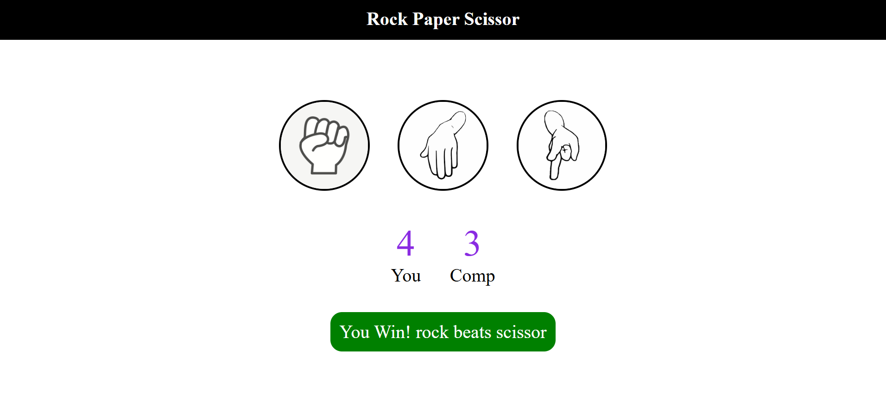

# ✊ Rock Paper Scissors Game

An interactive **Rock Paper Scissors** web game built using **HTML, CSS, and JavaScript**. The game allows users to play against the computer with real-time score tracking, instant result feedback, and an intuitive user interface.

---

## 📌 Live Demo

Live Website:
https://vishruth09.github.io/rock-paper-scissors-game/

---

## 📖 Project Overview

Rock Paper Scissors is a classic hand game recreated as a responsive web application. The player selects Rock, Paper, or Scissors, while the computer generates a random choice. The game instantly determines the winner based on the traditional rules and updates the scoreboard after every round.

This project demonstrates fundamental front-end web development concepts including DOM manipulation, event handling, conditional logic, and random number generation using JavaScript.

---

## ✨ Features

- 🎮 Interactive gameplay
- 🖱️ Click-based user controls
- 🤖 Random computer move generation
- 📊 Live score tracking
- 🏆 Instant win, lose, or draw detection
- 💬 Dynamic game status messages
- 📱 Simple and responsive interface
- ⚡ Fast and lightweight implementation

---

## 📂 Project Structure

```text
rock-paper-scissors-game/
│
├── assets/
│   ├── css/
│   │   └── style.css
│   │
│   ├── js/
│   │   └── scripts.js
│   │
│   └── images/
│       ├── rock.png
│       ├── paper.png
│       └── scissor.png
│
├── screenshots/
│   └── game-preview.png
│
├── .gitignore
├── LICENSE
├── README.md
├── favicon.ico
├── index.html
└── requirements.txt
```

---

## 🛠️ Tech Stack

| Technology | Purpose |
|------------|---------|
| HTML5 | Structure and layout |
| CSS3 | Styling and responsive design |
| JavaScript (ES6) | Game logic and interactivity |

---
## 📸 Screenshots

### Game Interface



> *Interactive gameplay featuring live score tracking and instant result updates.*

---

## 🚀 Getting Started

### Prerequisites

No additional software or dependencies are required. A modern web browser is sufficient.

### Installation

1. Clone the repository

```bash
git clone https://github.com/vishruth09/rock-paper-scissors-game.git
```

2. Navigate to the project directory

```bash
cd rock-paper-scissors-game
```

3. Open the project

Simply open the `index.html` file in your preferred web browser.

---

## 🎮 How to Play

1. Launch the game by opening **index.html** in your browser.
2. Click on one of the three available choices:
   - ✊ Rock
   - ✋ Paper
   - ✌️ Scissors
3. The computer automatically selects a random move.
4. The winner is determined according to the standard Rock Paper Scissors rules.
5. Scores are updated instantly after each round.
6. Continue playing as many rounds as you like.

---

## 📜 Game Rules

| Your Move | Computer Move | Result |
|-----------|---------------|--------|
| Rock | Scissors | ✅ You Win |
| Rock | Paper | ❌ Computer Wins |
| Paper | Rock | ✅ You Win |
| Paper | Scissors | ❌ Computer Wins |
| Scissors | Paper | ✅ You Win |
| Scissors | Rock | ❌ Computer Wins |
| Same Choice | Same Choice | 🤝 Draw |

---

## 🔮 Future Enhancements

Some potential improvements for future versions include:

- 🎵 Sound effects for user interactions
- 🎨 Multiple visual themes
- 📱 Improved mobile responsiveness
- 🏅 Match history tracking
- 🔄 Best-of-three and tournament modes
- 🌐 Online multiplayer support
- 💾 Local storage for persistent scores
- ✨ Animations and visual effects
- ⌨️ Keyboard controls
- 🤖 Adjustable computer difficulty levels

---

## 📄 License

This project is licensed under the **MIT License**.

See the [LICENSE](LICENSE) file for more information.

---

## 👨‍💻 Author

**Vishruth Palugula**

- GitHub: https://github.com/vishruth09
- LinkedIn: https://www.linkedin.com/in/vishruth-palugula-3715a6299

---

## ⭐ Support

If you found this project helpful or enjoyed playing the game, consider giving this repository a ⭐ on GitHub.

Your support is greatly appreciated!
